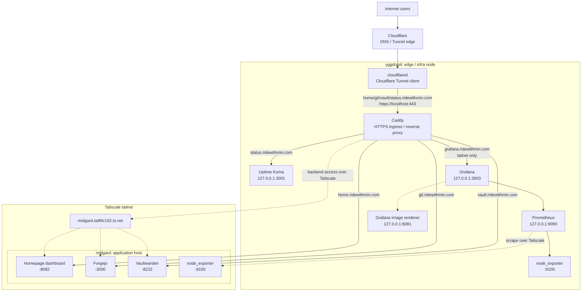
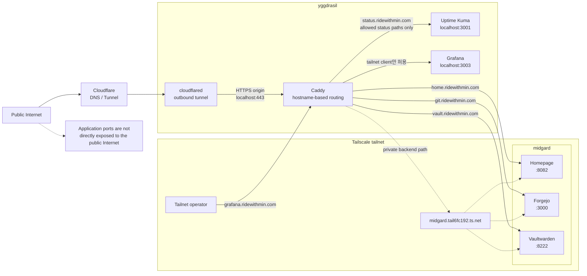

# Homelab

[English](README.md) | 한국어

이 repo는 두 대의 NixOS 머신으로 구성된 homelab의 source of truth다. 호스트
설정, 디스크 레이아웃, 공통 시스템 모듈, 서비스, 사용자 설정, 암호화된 secret을
모두 Nix flake 안에서 선언한다.

## 전체 아키텍처

구성은 edge/infra 노드와 application 노드로 나뉜다.



`flake.nix`는 NixOS 25.11을 pinning하고, 두 NixOS configuration을 노출한다.

- `yggdrasil`
- `midgard`

공통 시스템 설정은 `modules/`에서 로드되고, 각 호스트는
`hosts/<host>/default.nix`에서 하드웨어, 디스크, 서비스 모듈을 추가로
import한다.

## 호스트 역할

### yggdrasil

`yggdrasil`은 외부 진입점이자 경량 인프라 노드다.

주요 역할:

- Cloudflare Tunnel 유지
- Caddy reverse proxy 운영
- 공개 도메인을 내부 서비스로 라우팅
- Uptime Kuma 상태 페이지 제공
- Prometheus를 통한 node-level monitoring과 alert rule 평가
- tailnet으로 제한된 Caddy route를 통해 Grafana dashboard 제공

로드하는 서비스:

- `services/ingress.nix`
- `services/cloudflared.nix`
- `services/uptime-kuma.nix`
- `services/prometheus`
- `services/grafana`

### midgard

`midgard`는 실제 application host다.

주요 역할:

- Homelab dashboard 운영
- Forgejo 운영
- Vaultwarden 운영
- 향후 container 기반 application service를 위한 Podman runtime 제공

로드하는 서비스:

- `services/homepage.nix`
- `services/forgejo.nix`
- `services/vaultwarden.nix`

로드하는 호스트 전용 모듈:

- `modules/podman.nix`

## 공통 시스템 설정

모든 호스트는 `flake.nix`를 통해 같은 공통 모듈을 공유한다.

- `modules/base.nix`
- `modules/gc.nix`
- `modules/swap.nix`
- `modules/users.nix`
- `modules/ssh.nix`
- `modules/tailscale.nix`
- `modules/secrets.nix`

모든 호스트는 공통 node exporter service도 로드한다.

- `services/node-exporter.nix`

공통 baseline:

- Nix flakes와 `nix-command` 활성화
- systemd-boot 사용
- NetworkManager 사용
- NixOS firewall 활성화
- OpenSSH 활성화
- SSH password login 비활성화
- SSH root login 비활성화
- Tailscale 활성화
- zram swap 활성화
- weekly Nix garbage collection
- automatic Nix store optimisation
- `node_exporter`를 통한 node-level metric 노출

관리 사용자는 `poby`다. `poby`는 `wheel`, `networkmanager` 그룹에 속하고,
`wheel`에는 passwordless sudo가 허용된다.

## 사용자 환경

Home Manager는 NixOS module로 활성화되어 있고, 각 호스트의 switch 과정에 함께
적용된다. 용도는 장기 실행 application service가 아니라 `poby` 운영자 계정의
환경 관리다.

공통 Home Manager profile:

- `home/poby/base.nix`
  - `home.stateVersion`을 설정한다.
  - 기본 Bash, Git, tmux 설정을 관리한다.
  - 공통 editor와 pager 환경 변수를 설정한다.

- `home/poby/ops.nix`
  - `age`, `sops`, `just` 같은 운영자 전용 도구를 설치한다.
  - `journalctl`, `systemctl`, Tailscale 관련 공통 운영 alias를 정의한다.

호스트별 Home Manager profile:

- `home/poby/yggdrasil.nix`
  - Caddy, Cloudflare Tunnel, Uptime Kuma 확인을 위한 ingress 중심 alias를
    추가한다.

- `home/poby/midgard.nix`
  - Forgejo, Homepage, Vaultwarden, Podman 확인을 위한 application host alias를
    추가한다.
  - 운영자 관점의 점검 작업을 위해 `sqlite`를 설치한다.
  - Hermes Agent 설치를 위해 `home/poby/hermes-agent.nix`를 import한다.

### Hermes Agent

Hermes Agent는 `midgard`에서 NixOS system service가 아니라 `poby`의 Home
Manager 환경으로 설치한다.

선언된 패키지 모듈:

- `home/poby/hermes-agent.nix`

이 모듈은 upstream `hermes-agent` flake의 Hermes CLI를 설치하고, agent와 운영자가
사용할 수 있는 보조 도구인 `tirith`, `git`, `ripgrep`, `fd`, `jq`, `yq`,
`curl`, `wget`, `just`를 함께 설치한다.

현재 의도는 Hermes를 충분히 테스트하는 동안 mutable하게 유지하는 것이다. Runtime
state, OAuth credential, profile, memory, gateway 설정, `SOUL.md`/`USER.md`
수정은 다음 경로 아래에 둔다.

```text
/home/poby/.hermes
```

초기 설정은 `midgard`에서 `poby` 사용자로 대화식으로 진행한다.

```bash
ssh midgard
hermes auth add openai-codex
hermes setup
```

Telegram 및 다른 gateway integration도 실험 단계에서는 `poby` 사용자로 설정한다.
gateway를 SSH logout 이후에도 계속 실행해야 하면 `hermes gateway install`로 user
service를 설치하고, `poby`에 linger를 활성화한다.

현재 upstream NixOS module은 의도적으로 활성화하지 않는다. 원하는 Hermes profile,
provider, gateway, memory 구성이 안정화되면 그때 mutable 설정을 declarative Nix
설정으로 승격한다.

## 스토리지

디스크 레이아웃은 `disko`로 선언한다.

두 호스트 모두 단일 디스크의 단순한 GPT 레이아웃을 사용한다.

```text
GPT partition table
512M EFI System Partition  -> /boot, vfat
remaining disk             -> /, ext4
```

호스트별 디스크 설정:

- `hosts/yggdrasil/disko.nix`
- `hosts/midgard/disko.nix`

호스트별 hardware configuration:

- `hosts/yggdrasil/hardware-configuration.nix`
- `hosts/midgard/hardware-configuration.nix`

별도 swap partition은 없고, `modules/swap.nix`에서 zram swap을 사용한다.

## 서비스 라우팅

### Cloudflare Tunnel

`cloudflared`는 `yggdrasil`에서 실행된다.

Cloudflare Tunnel은 다음 public hostname을 `yggdrasil`의 local Caddy로 보낸다.

- `home.ridewithmin.com`
- `git.ridewithmin.com`
- `vault.ridewithmin.com`
- `status.ridewithmin.com`

각 hostname은 다음 origin으로 전달된다.

```text
https://localhost:443
```

요청별 `Host` header와 TLS origin server name은 각 public hostname에 맞춰진다.

### Caddy Ingress

Caddy는 `yggdrasil`에서 실행되며, public hostname별로 내부 backend를 선택한다.

```text
home.ridewithmin.com   -> http://midgard.tail6fc192.ts.net:8082
git.ridewithmin.com    -> http://midgard.tail6fc192.ts.net:3000
vault.ridewithmin.com  -> http://midgard.tail6fc192.ts.net:8222
status.ridewithmin.com -> http://127.0.0.1:3001
grafana.ridewithmin.com -> http://127.0.0.1:3003, tailnet client만 허용
```

Caddy는 Cloudflare DNS plugin을 사용해 ACME DNS challenge로 인증서를 발급받는다.

`status.ridewithmin.com`은 Uptime Kuma의 status page 관련 path만 proxy하고, 그
외 path는 `404`를 반환한다.

`grafana.ridewithmin.com`은 Tailscale 주소 대역에서 온 요청만 Caddy가 local
Grafana로 라우팅한다. 그 외 client는 `404`를 받는다. 이 hostname은 Cloudflare
Tunnel의 public hostname 목록에는 포함되어 있지 않다.

### Application Services

`midgard`에서 실행되는 application service:

- Homepage dashboard: `8082`
- Forgejo: `3000`
- Vaultwarden: `8222`

공개 URL:

- `https://home.ridewithmin.com`
- `https://git.ridewithmin.com`
- `https://vault.ridewithmin.com`

Forgejo는 registration과 Forgejo SSH가 비활성화되어 있다. Vaultwarden은 SQLite를
사용하고, public signup은 비활성화되어 있으며 invitation은 허용되어 있다.

## 모니터링

Prometheus와 Grafana는 `yggdrasil`에서 실행된다. Prometheus는 두 NixOS 호스트의
node-level metric을 수집하고, Grafana는 tailnet으로 제한된 Caddy route를 통해
운영자 dashboard를 제공한다. Uptime Kuma는 계속 public endpoint 확인과 public
status page를 담당한다.

모니터링 서비스:

- `services/prometheus`
  - `yggdrasil`에서 Prometheus를 활성화한다.
  - Prometheus UI/API를 `127.0.0.1:9090`에 bind한다.
  - node metric을 `3m`마다 scrape한다.
  - metric 보관 기간은 `15d`다.
  - alert rule은 `services/prometheus/node-health-alert-rule.yml`에서 로드한다.

- `services/node-exporter.nix`
  - 두 호스트 모두에서 `node_exporter`를 실행한다.
  - `:9100`에서 listen한다.
  - 일반 firewall port는 열지 않는다.
  - 모든 `.service` unit을 대상으로 systemd collector를 활성화한다.

- `services/grafana`
  - Grafana를 `127.0.0.1:3003`에서 활성화한다.
  - Prometheus를 기본 datasource로 provision한다.
  - `services/grafana/dashboards/node-overview.json`의 `Homelab Nodes`
    dashboard를 provision한다.
  - `grafana/admin_password` SOPS secret에서 admin password를 읽는다.
  - `grafana-image-renderer`를 `127.0.0.1:8081`에서 활성화한다.

Prometheus scrape target:

```text
127.0.0.1:9100                  -> yggdrasil node_exporter
midgard.tail6fc192.ts.net:9100  -> midgard node_exporter
```

현재 alert rule:

- `NodeDown`
- `CriticalServiceInactive`
- `SystemdServiceFailed`
- `RootDiskLow`
- `RootInodesLow`
- `RootFilesystemReadOnly`
- `LowMemory`
- `HighCpuUsage`
- `HighLoad`

Rule은 Prometheus UI에서 확인할 수 있다. Dashboard는 tailnet에서
`https://grafana.ridewithmin.com`으로 접근해 Grafana에서 확인한다.
Alertmanager를 통한 외부 알림 전송은 아직 구성하지 않았다.

## Container Runtime

Podman은 `modules/podman.nix`를 통해 `midgard`에서만 활성화된다. `yggdrasil`은
Podman 모듈을 import하지 않는다.

현재 Podman 설정:

- `virtualisation.podman.enable = true`
- `virtualisation.oci-containers.backend = "podman"`
- `podman-prune.timer`를 통한 weekly Podman auto-prune
- registry search path는 `docker.io`, `ghcr.io`로 제한
- system profile에 `podman-compose` 설치

`virtualisation.podman.extraPackages`는 의도적으로 비워둔다. `podman-compose`
CLI는 `environment.systemPackages`를 통해 노출하고, Podman wrapper 환경에는
추가하지 않는다. 이렇게 하면 container runtime 설정은 작게 유지하면서도
`midgard`에서 `podman-compose`와 `podman compose`를 모두 사용할 수 있다.

장기 실행 container service는 임의의 compose 명령보다
`virtualisation.oci-containers.containers`로 선언하는 것을 기본 원칙으로 한다.
Compose는 임시 테스트, upstream compose file 확인, 수동 운영 workflow를 위해
사용 가능하게 둔다.

## Secret 관리

Secret은 `sops-nix`로 관리한다.

암호화된 secret 파일:

- `secrets/ingress.yaml`
- `secrets/vaultwarden.yaml`

암호화 정책은 `.sops.yaml`에 있다. `secrets/[^/]+\.yaml`에 매칭되는 파일은 다음
age recipient들로 암호화된다.

- `poby`
- `yggdrasil`
- `midgard`

각 NixOS 호스트는 런타임에 자신의 SSH host key를 SOPS age identity로 사용한다.

```text
/etc/ssh/ssh_host_ed25519_key
```

즉, 호스트의 SSH host private key가 `.sops.yaml`에 등록된 recipient와 맞아야
해당 호스트가 repo의 secret을 복호화할 수 있다.

평문 secret 값은 Nix store에 저장하지 않는다. `sops-nix`가 activation/runtime
시점에 `/run/secrets` 계열의 파일이나 service-specific template로
materialize하고, 각 파일에 owner, group, mode를 적용한다.

현재 secret 사용처:

- `cloudflare/caddy_env`
  - Caddy가 사용한다.
  - Cloudflare DNS challenge용 API token을 담는다.
  - Caddy user/group 소유다.
  - mode는 `0400`이다.

- `cloudflare/cloudflared_tunnel_credentials`
  - `cloudflared`가 사용한다.
  - Cloudflare Tunnel credential을 담는다.
  - mode는 `0400`이다.

- `grafana/admin_password`
  - Grafana administrator password다.
  - SOPS가 materialize한 secret file을 Grafana가 직접 읽는다.
  - `grafana:grafana` 소유다.
  - mode는 `0400`이다.

- `vaultwarden/admin_token`
  - Vaultwarden admin token이다.
  - `vaultwarden.env` runtime template 안에 `ADMIN_TOKEN`으로 렌더링된다.
  - `vaultwarden:vaultwarden` 소유다.
  - mode는 `0400`이다.

## 외부 접근 통제

외부 인터넷 접근 경로는 직접 포트 노출이 아니라 Cloudflare Tunnel 중심이다.



현재 구성에서 NixOS firewall은 모든 호스트에서 활성화되어 있고, 직접 허용되는
TCP 포트는 SSH `22`다. `3000`, `3001`, `8082`, `8222`, `9090`, `9100` 같은
application 및 monitoring port는 일반 public firewall port로 열지 않는다.

`midgard`의 서비스들은 Caddy가 Tailscale MagicDNS 이름으로 접근한다.

```text
midgard.tail6fc192.ts.net
```

두 호스트 모두 `tailscale0` interface를 trusted interface로 둔다. 따라서
tailnet은 내부 네트워크 경계로 동작한다. public Internet 사용자는 Cloudflare에
연결된 hostname으로만 접근하고, tailnet에 들어온 기기는 Tailscale 정책에 따라
내부 서비스 포트에 더 직접적으로 접근할 수 있다.

이 repo에 선언된 접근 통제 범위:

- public hostname은 Cloudflare Tunnel로만 `yggdrasil`에 들어온다.
- Caddy가 hostname별 backend를 결정한다.
- Uptime Kuma public route는 status page path만 허용한다.
- Prometheus UI는 `yggdrasil`의 localhost에만 bind된다.
- Grafana는 localhost에 bind되고, Caddy가 tailnet client에 대해서만 라우팅한다.
- `node_exporter`는 내부 scrape 용도이며 public firewall port를 열지 않는다.
- application port는 일반 인터넷에 직접 열지 않는다.
- tailnet 내부 접근 제어는 이 repo가 아니라 Tailscale ACL과 tailnet 멤버십에
  의존한다.

Cloudflare Access 정책이 있다면 그것은 Cloudflare 쪽 설정이며, 현재 이 repo에는
선언되어 있지 않다.

## 운영

`Justfile`이 일반적인 배포 진입점이다.

새 설정을 boot default로 만들지 않고 적용 테스트:

```bash
just test yggdrasil
just test midgard
```

새 설정을 적용하고 boot default로 설정:

```bash
just switch yggdrasil
just switch midgard
```

내부적으로는 대상 호스트를 build host와 target host로 사용한다.

```text
nixos-rebuild <test|switch>
  --fast
  --flake .#<host>
  --build-host <host>
  --target-host <host>
  --use-remote-sudo
```

워크스테이션에서 명령을 실행하되, Linux system closure의 build와 activation은
대상 NixOS 호스트에서 수행하는 모델이다.

Prometheus UI는 SSH port forwarding으로 접근한다.

```bash
ssh -L 9090:127.0.0.1:9090 yggdrasil
```

그 다음 브라우저에서 연다.

```text
http://127.0.0.1:9090
```

Grafana는 Tailscale에 연결된 client에서 접근한다.

```text
https://grafana.ridewithmin.com
```

DNS나 browser routing이 불편하면 SSH port forwarding을 사용한다.

```bash
ssh -L 3003:127.0.0.1:3003 yggdrasil
```

그 다음 브라우저에서 연다.

```text
http://127.0.0.1:3003
```

## 검증

로컬에서 flake 평가 확인:

```bash
nix flake show --all-systems
nix flake check --no-build
```

각 호스트에서 기본 상태 확인:

```bash
hostname
systemctl is-active sshd
systemctl is-active tailscaled
tailscale status
zramctl
df -h
bootctl status
```

`yggdrasil`에서 Prometheus 상태 확인:

```bash
systemctl is-active prometheus prometheus-node-exporter
curl -fsS http://127.0.0.1:9090/-/ready
curl -fsS http://127.0.0.1:9090/api/v1/targets | jq
curl -fsS http://127.0.0.1:9090/api/v1/rules | jq
```

`yggdrasil`에서 Grafana 상태 확인:

```bash
systemctl is-active grafana grafana-image-renderer
curl -fsS http://127.0.0.1:3003/api/health | jq
```
