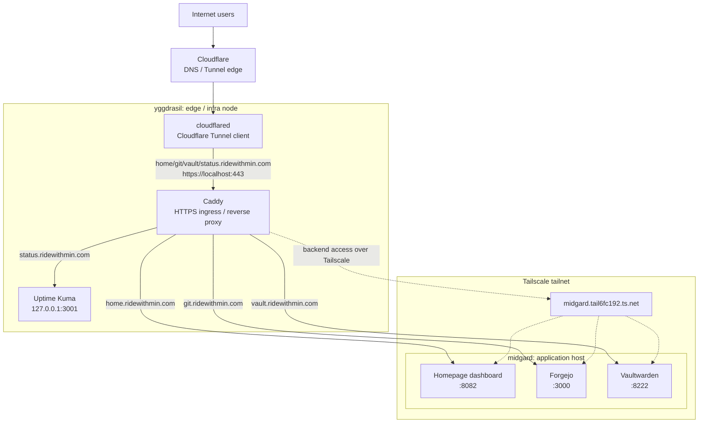
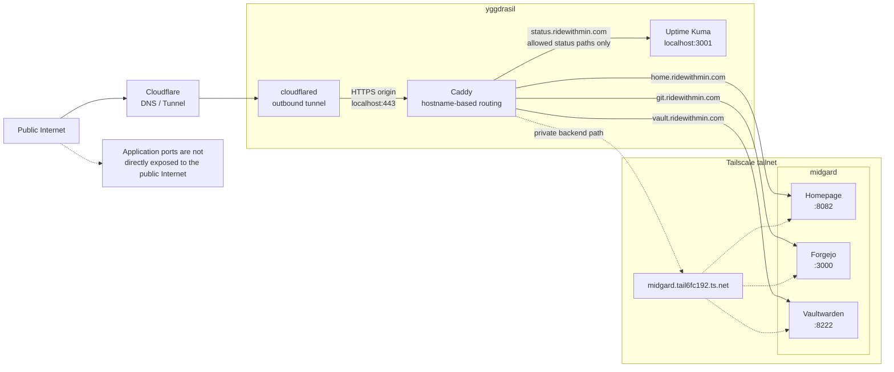

# Homelab

English | [한국어](README-ko.md)

This repo is the source of truth for a homelab made up of two NixOS machines.
Host configuration, disk layout, shared system modules, services, user
configuration, and encrypted secrets are all declared in a Nix flake.

## Overall Architecture

The setup is split into an edge/infra node and an application node.



`flake.nix` pins NixOS 25.11 and exposes two NixOS configurations.

- `yggdrasil`
- `midgard`

Shared system configuration is loaded from `modules/`, and each host imports
additional hardware, disk, and service modules from `hosts/<host>/default.nix`.

## Host Roles

### yggdrasil

`yggdrasil` is the public entry point and lightweight infrastructure node.

Main responsibilities:

- Maintain the Cloudflare Tunnel
- Run the Caddy reverse proxy
- Route public domains to internal services
- Serve the Uptime Kuma status page

Loaded services:

- `services/ingress.nix`
- `services/cloudflared.nix`
- `services/uptime-kuma.nix`

### midgard

`midgard` is the actual application host.

Main responsibilities:

- Run the Homelab dashboard
- Run Forgejo
- Run Vaultwarden

Loaded services:

- `services/homepage.nix`
- `services/forgejo.nix`
- `services/vaultwarden.nix`

## Shared System Configuration

All hosts share the same common modules through `flake.nix`.

- `modules/base.nix`
- `modules/gc.nix`
- `modules/swap.nix`
- `modules/users.nix`
- `modules/ssh.nix`
- `modules/tailscale.nix`
- `modules/secrets.nix`

Common baseline:

- Enable Nix flakes and `nix-command`
- Use systemd-boot
- Use NetworkManager
- Enable the NixOS firewall
- Enable OpenSSH
- Disable SSH password login
- Disable SSH root login
- Enable Tailscale
- Enable zram swap
- Run weekly Nix garbage collection
- Run automatic Nix store optimisation

The administrative user is `poby`. `poby` belongs to the `wheel` and
`networkmanager` groups, and passwordless sudo is allowed for `wheel`.

## Storage

Disk layout is declared with `disko`.

Both hosts use a simple single-disk GPT layout.

```text
GPT partition table
512M EFI System Partition  -> /boot, vfat
remaining disk             -> /, ext4
```

Host-specific disk configuration:

- `hosts/yggdrasil/disko.nix`
- `hosts/midgard/disko.nix`

Host-specific hardware configuration:

- `hosts/yggdrasil/hardware-configuration.nix`
- `hosts/midgard/hardware-configuration.nix`

There is no separate swap partition. zram swap is configured in
`modules/swap.nix`.

## Service Routing

### Cloudflare Tunnel

`cloudflared` runs on `yggdrasil`.

Cloudflare Tunnel sends the following public hostnames to local Caddy on
`yggdrasil`.

- `home.ridewithmin.com`
- `git.ridewithmin.com`
- `vault.ridewithmin.com`
- `status.ridewithmin.com`

Each hostname is forwarded to the following origin.

```text
https://localhost:443
```

The request `Host` header and TLS origin server name are set to match each
public hostname.

### Caddy Ingress

Caddy runs on `yggdrasil` and selects the internal backend by public hostname.

```text
home.ridewithmin.com   -> http://midgard.tail6fc192.ts.net:8082
git.ridewithmin.com    -> http://midgard.tail6fc192.ts.net:3000
vault.ridewithmin.com  -> http://midgard.tail6fc192.ts.net:8222
status.ridewithmin.com -> http://127.0.0.1:3001
```

Caddy uses the Cloudflare DNS plugin to issue certificates through ACME DNS
challenges.

`status.ridewithmin.com` proxies only Uptime Kuma status-page related paths and
returns `404` for every other path.

### Application Services

Application services running on `midgard`:

- Homepage dashboard: `8082`
- Forgejo: `3000`
- Vaultwarden: `8222`

Public URLs:

- `https://home.ridewithmin.com`
- `https://git.ridewithmin.com`
- `https://vault.ridewithmin.com`

Forgejo registration and Forgejo SSH are disabled. Vaultwarden uses SQLite,
disables public signup, and allows invitations.

## Secret Management

Secrets are managed with `sops-nix`.

Encrypted secret files:

- `secrets/ingress.yaml`
- `secrets/vaultwarden.yaml`

The encryption policy lives in `.sops.yaml`. Files matching
`secrets/[^/]+\.yaml` are encrypted for the following age recipients.

- `poby`
- `yggdrasil`
- `midgard`

At runtime, each NixOS host uses its own SSH host key as the SOPS age identity.

```text
/etc/ssh/ssh_host_ed25519_key
```

This means a host can decrypt the repo secrets only when its SSH host private
key matches a recipient registered in `.sops.yaml`.

Plaintext secret values are not stored in the Nix store. During
activation/runtime, `sops-nix` materializes them as files under `/run/secrets`
or as service-specific templates, then applies the owner, group, and mode to
each file.

Current secret consumers:

- `cloudflare/caddy_env`
  - Used by Caddy.
  - Contains the Cloudflare API token for DNS challenges.
  - Owned by the Caddy user/group.
  - Mode is `0400`.

- `cloudflare/cloudflared_tunnel_credentials`
  - Used by `cloudflared`.
  - Contains the Cloudflare Tunnel credential.
  - Mode is `0400`.

- `vaultwarden/admin_token`
  - Vaultwarden admin token.
  - Rendered into the `vaultwarden.env` runtime template as `ADMIN_TOKEN`.
  - Owned by `vaultwarden:vaultwarden`.
  - Mode is `0400`.

## External Access Control

External Internet access is centered on Cloudflare Tunnel instead of directly
exposed ports.



In the current configuration, the NixOS firewall is enabled on every host, and
the directly allowed TCP port is SSH `22`. Application ports such as `3000`,
`3001`, `8082`, and `8222` are not opened as general public firewall ports.

Services on `midgard` are reached by Caddy through the Tailscale MagicDNS name.

```text
midgard.tail6fc192.ts.net
```

Both hosts mark the `tailscale0` interface as trusted. The tailnet therefore
acts as the internal network boundary. Public Internet users can access only the
hostnames connected through Cloudflare, while devices inside the tailnet may
reach internal service ports more directly depending on Tailscale policy.

Access control declared in this repo:

- Public hostnames enter `yggdrasil` only through Cloudflare Tunnel.
- Caddy decides the backend for each hostname.
- The public Uptime Kuma route allows only status-page paths.
- Application ports are not directly opened to the general Internet.
- Internal tailnet access control depends on Tailscale ACLs and tailnet
  membership, not this repo.

If Cloudflare Access policies exist, they are Cloudflare-side settings and are
not declared in this repo.

## Operations

`Justfile` is the normal deployment entrypoint.

Apply a new configuration for testing without making it the boot default:

```bash
just test yggdrasil
just test midgard
```

Apply a new configuration and make it the boot default:

```bash
just switch yggdrasil
just switch midgard
```

Internally, the target host is used as both the build host and the target host.

```text
nixos-rebuild <test|switch>
  --fast
  --flake .#<host>
  --build-host <host>
  --target-host <host>
  --use-remote-sudo
```

The command is run from the workstation, while the Linux system closure is built
and activated on the target NixOS host.

## Validation

Check flake evaluation locally:

```bash
nix flake show --all-systems
nix flake check --no-build
```

Check the basic state on each host:

```bash
hostname
systemctl is-active sshd
systemctl is-active tailscaled
tailscale status
zramctl
df -h
bootctl status
```
