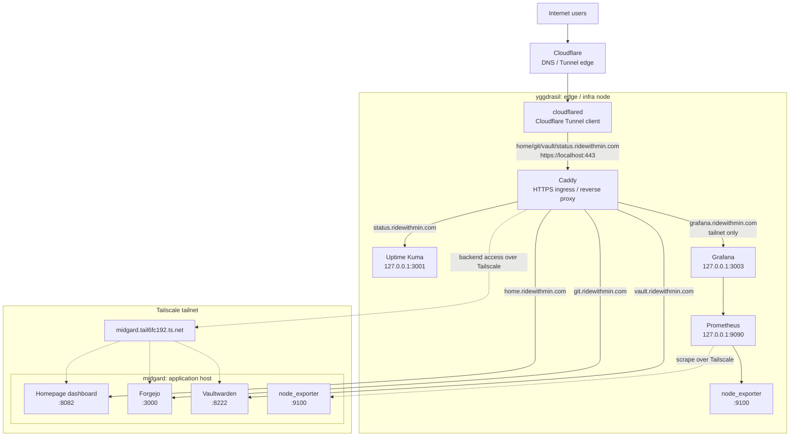

# Architecture

The setup is split into an edge/infra node (`yggdrasil`) and an application
node (`midgard`). External traffic enters only through **Cloudflare Tunnel →
Caddy** instead of directly exposed ports, and the **Tailscale tailnet** is
the internal network boundary between hosts.



Who can reach what across these boundaries (public Internet, tailnet,
localhost) is covered in the [security model](security.md).

## Shared system configuration

All hosts load the same common modules through `flake.nix`.

| Module | Purpose |
| --- | --- |
| `modules/base.nix` | flakes/`nix-command`, systemd-boot, NetworkManager, firewall |
| `modules/gc.nix` | weekly Nix GC + automatic store optimisation |
| `modules/swap.nix` | zram swap (no separate swap partition) |
| `modules/users.nix` | operator `poby` (`wheel`, passwordless sudo) |
| `modules/ssh.nix` | OpenSSH, password/root login disabled |
| `modules/tailscale.nix` | Tailscale |
| `modules/secrets.nix` | sops-nix base configuration |
| `services/node-exporter.nix` | node_exporter on every host (`:9100`) |
| `services/alloy.nix` | log collection (shipped to Loki) |

## Storage

Disk layout is declared with `disko`. All hosts use a simple single-disk GPT
layout.

```text
GPT partition table
512M EFI System Partition  -> /boot, vfat
remaining disk             -> /, ext4
```

## User environment

Home Manager is enabled through the NixOS module and applied as part of each
host switch. It is used **only for the `poby` operator environment**, not for
long-running services. The shared profiles (`home/poby/base.nix`, `ops.nix`)
carry shell/Git/tmux configuration and operator tools such as `age`, `sops`,
and `just`; per-host profiles add host-specific aliases.
