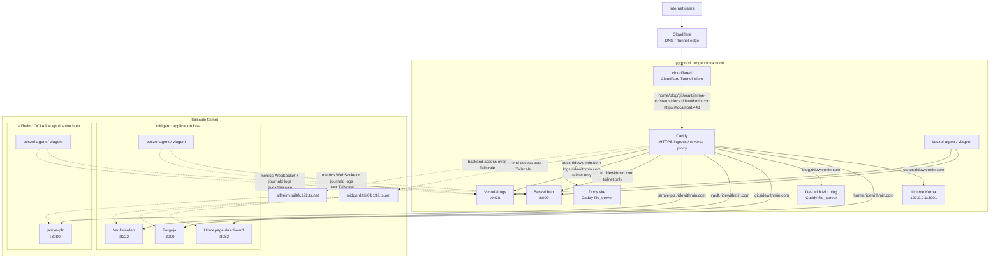

# Architecture

The homelab has three roles: `yggdrasil` is the edge and infrastructure node,
`midgard` is the primary application node, and `alfheim` is the cloud ARM
application node. External traffic enters through Cloudflare Tunnel → Caddy,
with no directly exposed application ports. The Tailscale tailnet carries
traffic between hosts.


```mermaid
flowchart TD
    internet["Internet users"]
    cloudflare["Cloudflare<br/>DNS / Tunnel edge"]

    subgraph yggdrasil["yggdrasil: edge / infra node"]
        cloudflared["cloudflared<br/>Cloudflare Tunnel client"]
        caddy["Caddy<br/>HTTPS ingress / reverse proxy"]
        blog["Dev with Min blog<br/>Caddy file_server"]
        docsSite["Docs site<br/>Caddy file_server"]
        kuma["Uptime Kuma<br/>127.0.0.1:3001"]
        beszelHub["Beszel hub<br/>:8090"]
        vlogs["VictoriaLogs<br/>:9428"]
        yShipper["beszel-agent / vlagent"]
    end

    subgraph tailnet["Tailscale tailnet"]
        midgardDns["midgard.tail6fc192.ts.net"]
        alfheimDns["alfheim.tail6fc192.ts.net"]

        subgraph midgard["midgard: application host"]
            homepage["Homepage dashboard<br/>:8082"]
            forgejo["Forgejo<br/>:3000"]
            vaultwarden["Vaultwarden<br/>:8222"]
            mShipper["beszel-agent / vlagent"]
        end

        subgraph alfheim["alfheim: OCI ARM application host"]
            jamyePlz["jamye-plz<br/>:8080"]
            aShipper["beszel-agent / vlagent"]
        end
    end

    internet --> cloudflare
    cloudflare --> cloudflared
    cloudflared -->|"home/blog/git/vault/jamye-plz/status/docs.ridewithmin.com<br/>https://localhost:443"| caddy

    caddy -->|"status.ridewithmin.com"| kuma
    caddy -->|"home.ridewithmin.com"| homepage
    caddy -->|"blog.ridewithmin.com"| blog
    caddy -->|"git.ridewithmin.com"| forgejo
    caddy -->|"vault.ridewithmin.com"| vaultwarden
    caddy -->|"jamye-plz.ridewithmin.com"| jamyePlz
    caddy -->|"beszel.ridewithmin.com<br/>tailnet only"| beszelHub
    caddy -->|"logs.ridewithmin.com<br/>tailnet only"| vlogs
    caddy -->|"docs.ridewithmin.com"| docsSite

    caddy -.->|backend access over Tailscale| midgardDns
    caddy -.->|backend access over Tailscale| alfheimDns
    midgardDns -.-> homepage
    midgardDns -.-> forgejo
    midgardDns -.-> vaultwarden
    alfheimDns -.-> jamyePlz

    yShipper --> beszelHub
    yShipper --> vlogs
    mShipper -.->|metrics WebSocket + journald logs<br/>over Tailscale| beszelHub
    mShipper -.-> vlogs
    aShipper -.->|metrics WebSocket + journald logs<br/>over Tailscale| beszelHub
    aShipper -.-> vlogs
```

The [security model](security.md) explains who can cross each boundary: public
Internet, tailnet, and localhost.

## Shared system configuration

All hosts load the same common modules through `flake.nix`.

| Module | Purpose |
| --- | --- |
| `modules/base.nix` | flakes/`nix-command`, systemd-boot, NetworkManager, firewall |
| `modules/gc.nix` | weekly Nix GC + automatic store optimisation |
| `modules/swap.nix` | zram swap (no separate swap partition) |
| `modules/users.nix` | operator `poby` (`wheel`, passwordless sudo) |
| `modules/ssh.nix` | OpenSSH, password/root login disabled |
| `modules/tailscale.nix` | Tailscale |
| `modules/secrets.nix` | sops-nix base configuration |
| `services/log-shipper.nix` | journald → VictoriaLogs shipping on every host (journal-upload + vlagent) |
| `services/beszel/agent.nix` | Beszel metrics agent on every host |

## Storage

`disko` declares the disk layout. All hosts use a simple single-disk GPT
layout.

```text
GPT partition table
512M EFI System Partition  -> /boot, vfat
remaining disk             -> /, ext4
```

## User environment

The NixOS module enables Home Manager and applies it during each host switch.
It configures only the `poby` operator environment, not long-running services.
The shared profiles (`home/poby/base.nix`, `ops.nix`) contain shell, Git, and
tmux configuration plus operator tools such as `age`, `sops`, and `just`.
Per-host profiles add host-specific aliases.
