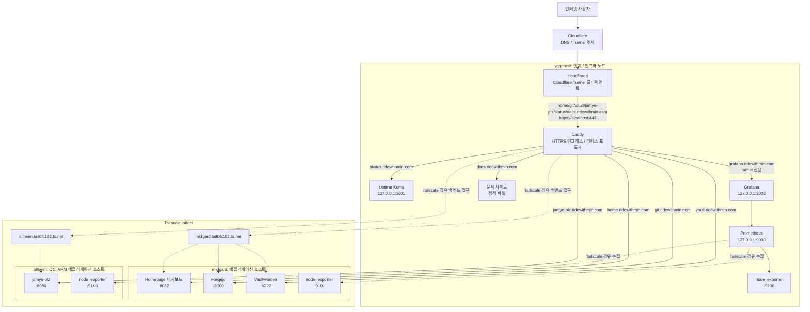

# 아키텍처

구성은 엣지/인프라 노드(`yggdrasil`), 주 애플리케이션 노드(`midgard`),
클라우드 ARM 애플리케이션 노드(`alfheim`)로 나뉩니다. 외부 트래픽은 포트를
직접 열지 않고 Cloudflare Tunnel → Caddy 경로로만 들어오며 호스트 간 내부
통신은 Tailscale tailnet을 경계로 삼습니다.



이 경계들(공개 인터넷, tailnet, localhost)을 누가 넘는지는
[보안 모델](security.md)에서 다룹니다.

## 공유 시스템 구성

모든 호스트는 `flake.nix`에서 공통 모듈을 로드합니다.

| 모듈 | 내용 |
| --- | --- |
| `modules/base.nix` | flakes/`nix-command`, systemd-boot, NetworkManager, 방화벽 |
| `modules/gc.nix` | 주간 Nix GC + 스토어 자동 최적화 |
| `modules/swap.nix` | zram 스왑 (별도 스왑 파티션 없음) |
| `modules/users.nix` | 운영자 `poby` (`wheel`, passwordless sudo) |
| `modules/ssh.nix` | OpenSSH, 패스워드/루트 로그인 비활성 |
| `modules/tailscale.nix` | Tailscale |
| `modules/secrets.nix` | sops-nix 기본 설정 |
| `services/node-exporter.nix` | 모든 호스트의 node_exporter (`:9100`) |
| `services/alloy.nix` | 로그 수집 (Loki로 전송) |

## 스토리지

디스크 레이아웃은 `disko`로 선언하며 모든 호스트가 단일 디스크 GPT
레이아웃을 사용합니다.

```text
GPT 파티션 테이블
512M EFI 시스템 파티션  -> /boot, vfat
나머지 디스크           -> /, ext4
```

## 사용자 환경

Home Manager는 NixOS 모듈로 활성화되어 호스트 switch 시 함께 적용되며
`poby` 운영자 환경 전용입니다. 장기 실행 서비스에는 사용하지 않습니다.
공유 프로필(`home/poby/base.nix`, `ops.nix`)에 셸/Git/tmux 설정과
`age`·`sops`·`just` 같은 운영 도구가 들어가고 호스트별 프로필이 각 호스트에
맞는 별칭을 추가합니다.
